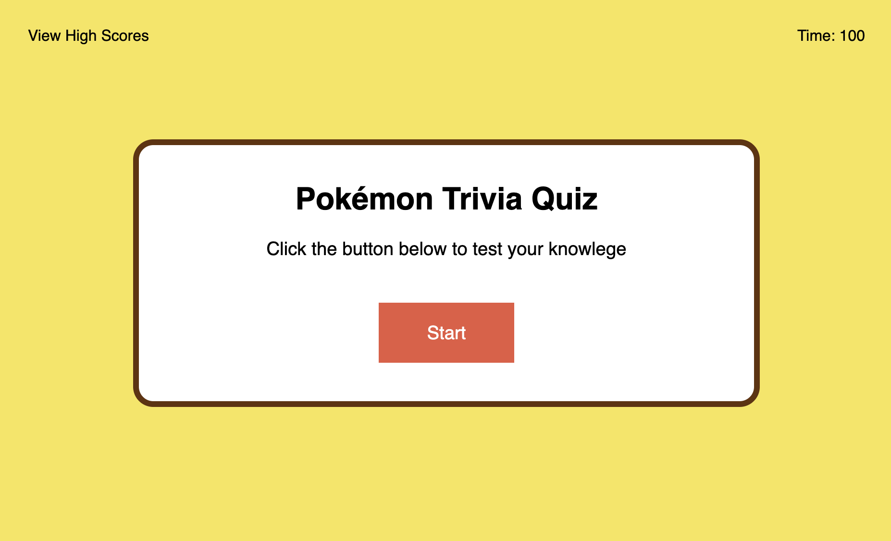
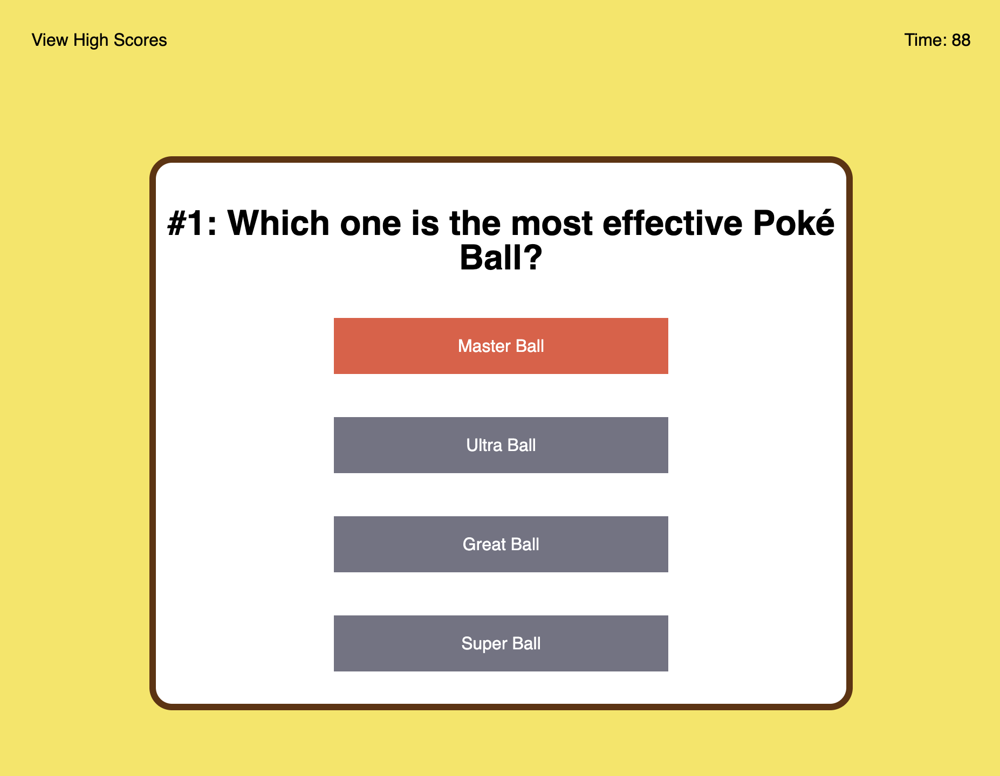
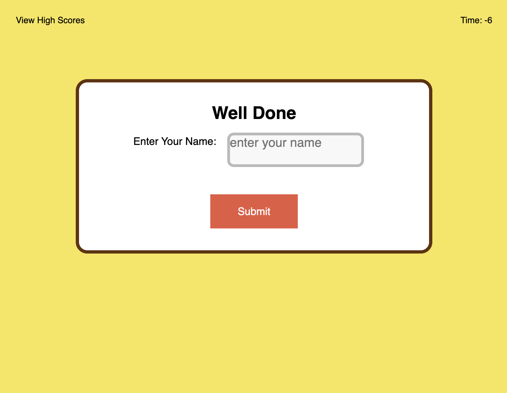
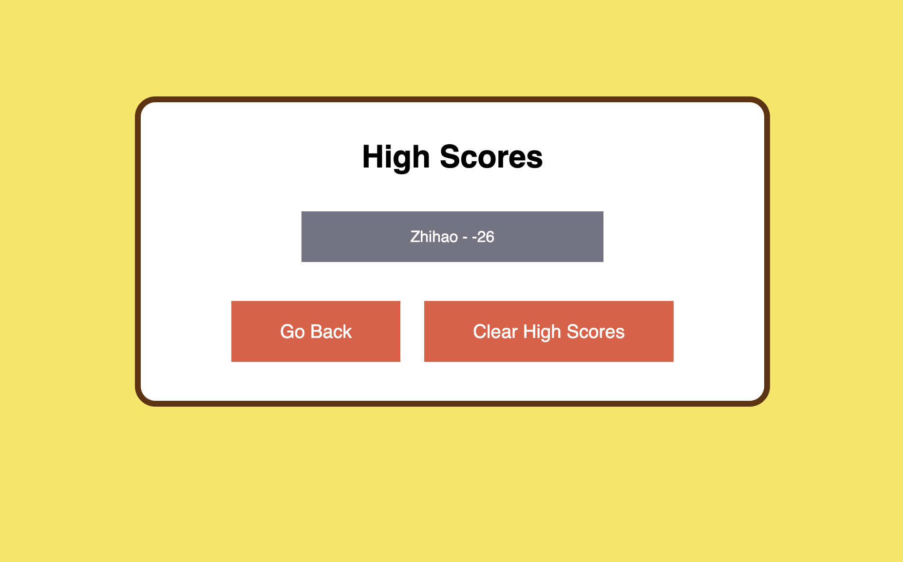
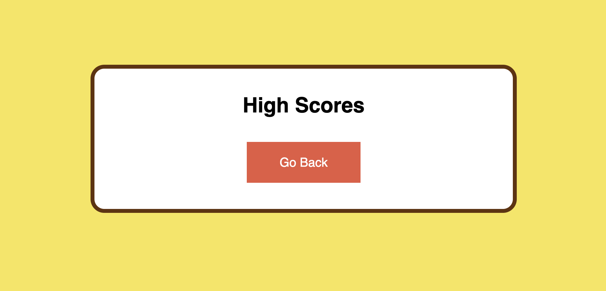

# Pokémon Trivia Quiz

## Description

This project is to create an application that allows users to challenge their knowledges about Pokémon through a timed trivia quiz. 

## Strategies

1. The user will see the first question after clicking the start button.
2. The timer will start after clicking the start button, and the time left will be shown on the top right.
3. The user will be presented another question after answering the previous question.
4. When the user's answer is incorrect, the time will be subtracted from the timer.
5. When all questions are answered or timer reaches 0, the game will be over.
6. The final score equals to the time left.
7. User can type name after answering all questions and see the high score list.

## Application URL

https://lzh1990214.github.io/quiz/

## Screenshot

Main page with a red 'start" button:

Question page:

Text area for recording user's name:

Score board showing score history:

Score board is cleared after clicking "clear high scores":

